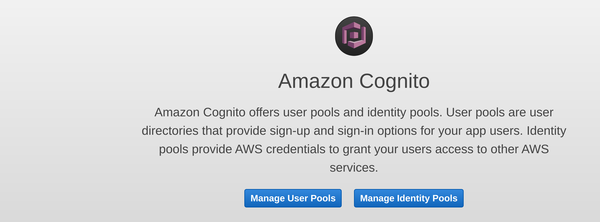
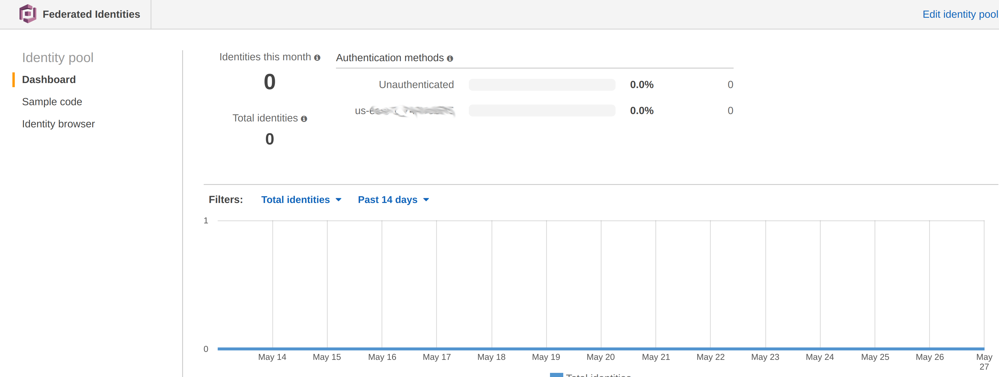
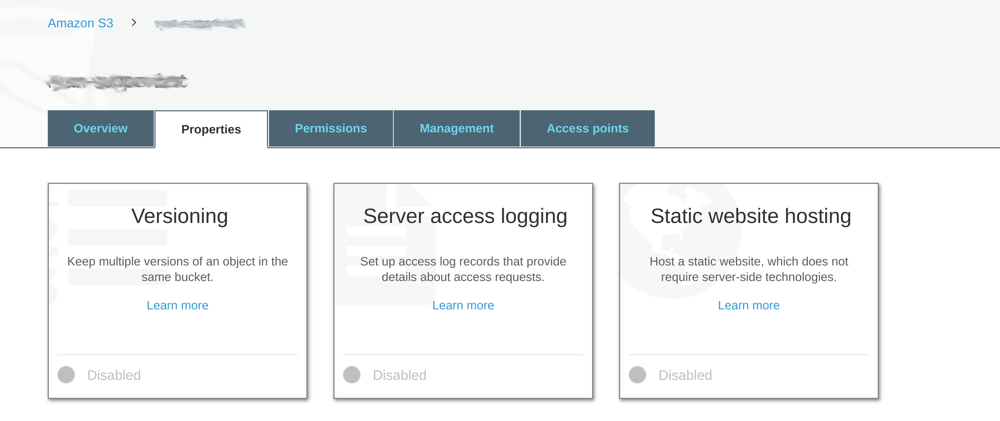
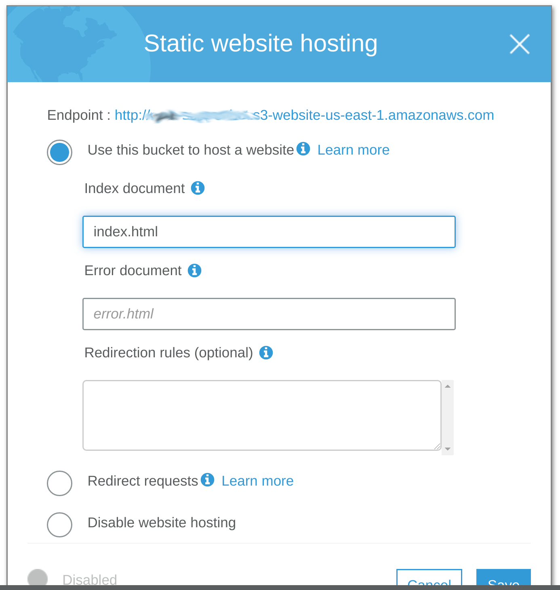
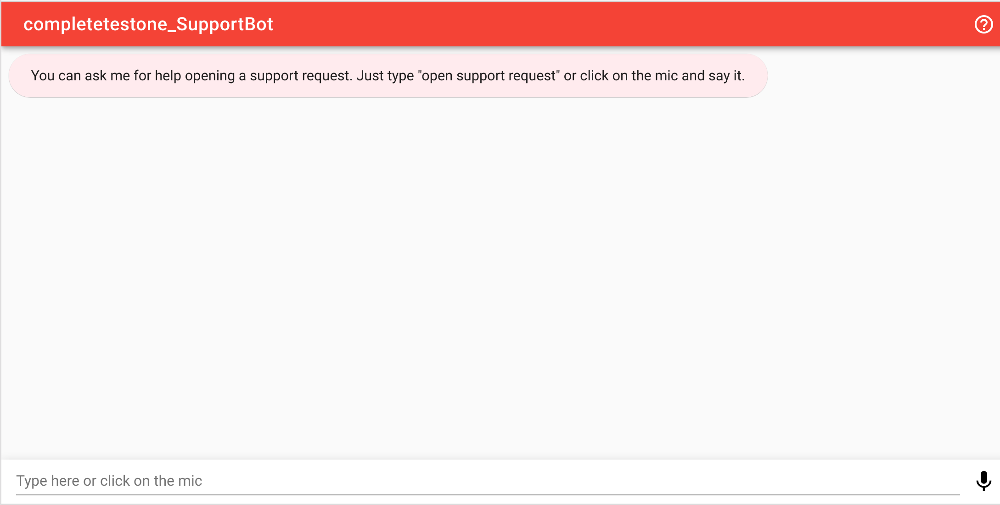
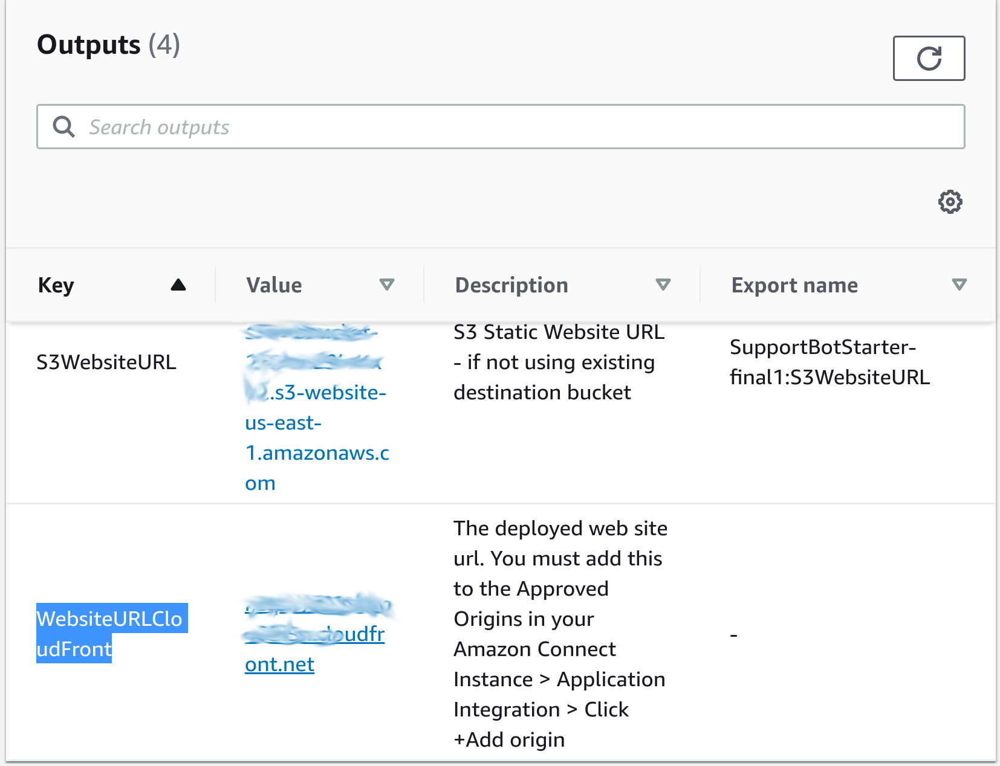

# Complete the Web Application Deployment

In this section, you will be updating configuration files. 

The Web UI is the standard Lex Web UI which uses Vue, CSS, HTML and Javascript.
There are two configuration files that are updated automatically in the complete/templates/lex-supportbot-complete.template.
The files are located in the web/ folder:
 
- lex-web-ui-loader-config.json (Main configuration)
- aws-config.js (Used for Mobile but required)

You will need the following details when using this UI for your projects:

For aws-config.js you need to provide the following:
- poolId (AWS Cognito Identity Pool ID - follow steps below to find this)
- botAlias (Default is $LATEST or can put a specific version here)
- botName (Name of your bot)
- region_name (Region of your bot)
- description (For informational purposes)
- commands-help (Suggested things to type)

For lex-web-ui-loader-config.json you need to provide the following:
- poolId (Congnito Identity Pool, follow steps below to find this)
- region (Cognito region)
- botName (Name of your bot)
- botAlias (Default to $LATEST or put in a specific version)
- toolbarTitle (Title shown on page)
- enable_login (Default false, enable to turn on Logins)
- helpIntent (If you want to make a help intent put it's name here)
- voiceId (You can change the voice or leave default)
- preset (Can leave default)
- region (for bot)

To find your Cognito pool ID, go to your AWS Console -> Cognito -> Identity Pools -> click on identity pool -> Edit Identity Pool

1. Click on identity pools

2. Click on the identity pool the CloudFormation template created

3. Click on link to edit identity pool

4. Note the identity pool ID, needed for the configuration

## Upload the web directory to your public S3 bucket

You can use the deployment the CloudFormation script created, or make your own public bucket with Static Website turned on.

If you'd like to make your own follow the steps below:

- take your copies of the two configuration files from the steps above, copy them into your web/ directory, and copy the contents to an S3 Bucket

- Now you can turn your S3 Bucket into a static hosted website:

- Go to properties, then to static hosting:

- Select "Use this bucket to host a website" and enter index.html for the index page. Leave all other settings as is. 

Now you have a nice web interface that should look like this (you will get javascript errors trying to use it until you have set everything up):

If you'd rather just use what CloudFormation created, go to the 'Outputs' tab of the CloudFormation script.
Simply open your browser to the value for key 'WebsiteURLCloudFront':

:warning: Please note - S3WebsiteURL will give you an 403 Access Denied, make sure you use the WebsiteURLCloudFront key instead.

Go to
[**Module 2: Create AWS Lambda Functions for Validation and Intent Fulfillment**](../Module%202%20Create%20Lambda%20Functions/README.md)